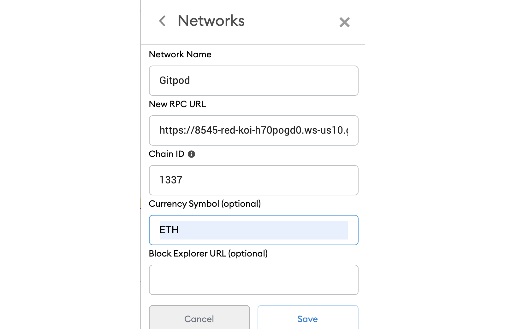

# [WIP] full-stack dApp starter for solidity smart contract development

A monorepo boilerplate code for typesafe full-stack [Solidity](https://soliditylang.org/) development.

:warning: This repository uses foundry instead of hardhat

## Contents

- [Prerequisites](#prerequisites)
- [Features](#features)
- [Run in Gitpod](#run-in-gitpod)
- [Run Locally](#run-locally)
- [Build For Production](#build-for-production)
- [Acknowledgements](#acknowledgements)
- [License](#license)
- [Deployment](#deployment)

## Prerequisites

- [pnpm](https://pnpm.io/)
- [Node.js](https://nodejs.org/en/download/)
- [MetaMask wallet browser extension](https://metamask.io/download.html).

## Features

Here's an overview of the included frameworks and tools.

- **Next.js** - Minimalistic framework for server-rendered React applications.
- **Typescript** - Superset of JavaScript which primarily provides optional static typing, classes and interfaces.
- **ESLint** - The pluggable linting utility.
- **Turborepo** - High-performance build system for JavaScript and TypeScript codebases.
- **PNPM** - Fast, disk space efficient package manager.
- **Wagmi** - React Hooks library for Ethereum.
- **Tailwind CSS** - Rapidly build modern websites without ever leaving your HTML.
- **Typechain** - TypeScript bindings for Ethereum smart contracts.
- **Foundry** - Ethereum development environment for professionals.
- **Husky** - Git hooks made easy 🐶 woof!.
- **Prettier** - Prettier is an opinionated code formatter..
- **Chai** - A BDD / TDD assertion library for node and the browser that can be delightfully paired with any javascript testing framework.
- **Mocha** - A feature-rich JavaScript test framework.

## Run in Gitpod

To run this project in Gitpod, follow these steps:
<br/>

1. Click this link to deploy to gitpod
   <br/>

[](https://gitpod.io/#github.com/G3root/nextjs-dapp-starter-ts)

2. Import the RPC address given to you by GitPod into your MetaMask wallet

This endpoint will look something like this:

```bash
https://8545-copper-swordtail-j1mvhxv3.ws-eu18.gitpod.io/
```

The chain ID should be 1337. If you have a localhost rpc set up, you may need to overwrite it.
<br/>



you can also change your status of your open ports by going to port settings.
<br/>

## Run Locally

Clone the project

```bash
  npx degit G3root/nextjs-dapp-starter-ts my-project
```

Go to the project directory

```bash
  cd my-project
```

Install dependencies

```bash
  pnpm install
```

Start the development server

```bash
  pnpm dev
```

## Build For Production

To generate production build

```bash
 pnpm build
```

## deployment

Setting Build & Development Settings on [vercel](https://vercel.com/)

### BUILD COMMAND

```
npx pnpm build

```

### INSTALL COMMAND

```
cd ../.. && npx pnpm install
```

## Acknowledgements

- [template-ethereum-contracts](https://github.com/wighawag/template-ethereum-contracts)

## License

[MIT](https://choosealicense.com/licenses/mit/)
